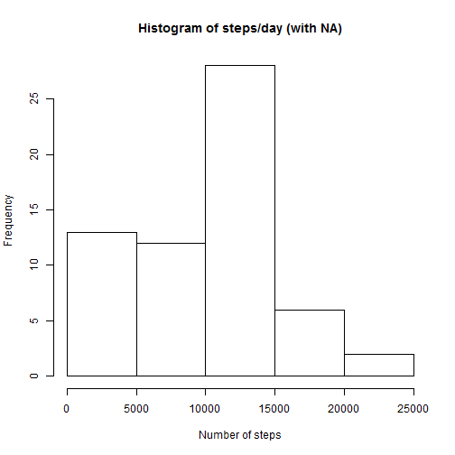
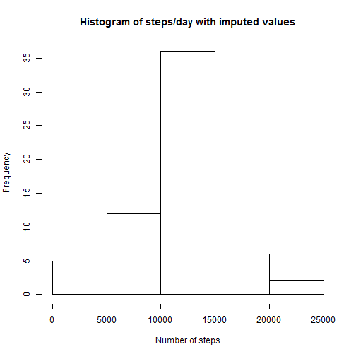
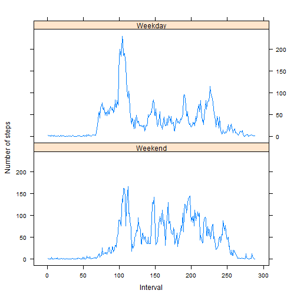

##Assignment 1, Reproducible Research##

###Loading data and required libraries:###

```r
library(dplyr)
library(lattice)
activity <- read.csv("activity.csv")
```


###Question 1: What is mean total number of steps taken per day?###
*Finding the total number of steps/ day and plotting as a histogram*

```r
#grouping activity by date and then finding the sum of number of steps/ day
daily <- group_by(activity, date)
dailySteps <- summarize (daily, steps = sum(steps, na.rm = TRUE))
#plotting and responding to the specific questions asked (histogram, mean and median)
hist(dailySteps$steps, xlab="Number of steps", main = "Histogram of steps/day (with NA)")
```

 


*Finding the mean and median number of steps/ day*

```r
mean(dailySteps$steps)
```

```
## [1] 9354.23
```

```r
median(dailySteps$steps)
```

```
## [1] 10395
```


###Question 2: What is the average daily activity pattern?###
*Generating the time series plot of number of steps taken by time interval averaged across all days*

```r
#grouping activity by the 5 minute intervals each day is split into
fiveMin <- group_by(activity, interval)
#finding the average of number of steps/ interval (data within each interval is from 
#the same time slot across multiple days)
fiveMinSteps <- summarize (fiveMin, steps = mean(steps, na.rm=TRUE))
#adding an ID to each interval. 288 intervals of 5 minutes each = 1,440 minutes = 24 hours/ day
fiveMinSteps$intervalID <- seq(1:288)
#plotting average number of steps against interval ID
with(fiveMinSteps, plot(steps~intervalID, type = "l", ylab = "Number of steps", xlab = "Interval"))
```

 


*Identifying the interval id which has the max number of steps, averaged across all days*

```r
#identifying the interval id which has the max number of steps, averaged across all days
maxAvg <- filter(fiveMinSteps, fiveMinSteps$steps == max(fiveMinSteps$steps))
maxAvg[[3]]
```

```
## [1] 104
```


###Question 3: Imputing missing values###
*Total number of rows with NAs*

```r
#Part 1
#Total number of rows with NAs
table(complete.cases(activity))[[1]]
```

```
## [1] 2304
```


*Imputing interval mean values where there are NAs*

```r
#Part 2
#Step 1: Create a vector of mean steps/ interval and repeat it for each of the 61 days
#for which data has been captured.
#Step 2: Bind the new vector to the original activity data frame
#Step 3: Subset two separate data frames with and without NA
#Step 4: Impute interval mean values to NA

#Step1
meanSteps <- rep(fiveMinSteps$steps, 61)
#Step2
activity2 <- cbind(activity, meanSteps)
#Step3
activity3 <- subset(activity2, is.na(activity2$steps))
activity4 <- subset(activity2, !is.na(activity2$steps))
#Step4
activity3$steps <- activity3$meanSteps
```


*Creating a new dataset equal to the original dataset but with missing data filled in*

```r
#Part 3
#Merge the data frame originally with out NA and the one in which values are imputed
activity5 <- rbind(activity3, activity4)
```


*Plotting a histogram*

```r
#Part 4
#Group by date, sum steps by date, plot histogram and find mean & median
activity6 <- group_by(activity5, date)
activity7 <- summarize (activity6, steps = sum(steps))
hist(activity7$steps, xlab="Number of steps", main = "Histogram of steps/day with imputed values")
```

 


*Calculating the mean and median with imputed values. As seen, there is a significant difference between the raw data and imputing values. The Mean and Median are not only higher now, the Mean is also equal to the Median.*

```r
#Part 4
#Group by date, sum steps by date, plot histogram and find mean & median
mean(activity7$steps)
```

```
## [1] 10766.19
```

```r
median(activity7$steps)
```

```
## [1] 10766.19
```


###Question 4: Are there differences in activity patterns between weekdays and weekends?###
*Separating the data into weekday and weekend to observe differences in activity levels. The key difference is the higher level of activity through the day on weekdays and the big spike on weekend mornings.*

```r
#Step 1: Determine the day of the week and add this information as a new column
weekDay <- weekdays(as.Date(as.character(activity5$date)))
activity8 <- cbind(activity5, weekDay)
#Step 2: Subset weekend data, group by interval, calculate average steps/ interval across 
#weekend days
activity9 <- subset(activity8, activity8$weekDay %in% c("Saturday", "Sunday"))
activity10 <- group_by(activity9, interval)
activity11 <- summarize (activity10, steps = mean(steps))
#Step 3: Add interval ID and a weekend flag as new columns
activity11$intervalID <- seq(1:288)
activity11$Day <- as.factor(rep("Weekend", 288))
#Step 4: Subset weekday data, group by interval, calculate average steps/ interval across 
#weekdays
activity12 <- activity8[!(activity8$weekDay %in% c("Saturday", "Sunday")),]
activity13 <- group_by(activity12, interval)
activity14 <- summarize (activity13, steps = mean(steps))
#Step 5: Add interval ID and a weekday flag as new columns
activity14$intervalID <- seq(1:288)
activity14$Day <- as.factor(rep("Weekday", 288))
#Step 6: Combine the weekday and weekend data and plot it using the lattice plotting system
activity15 <- rbind(activity11, activity14)
xyplot(steps~intervalID | Day, data = activity15, layout =c(1,2), type = "l", ylab = "Number of steps", xlab = "Interval")
```

 

